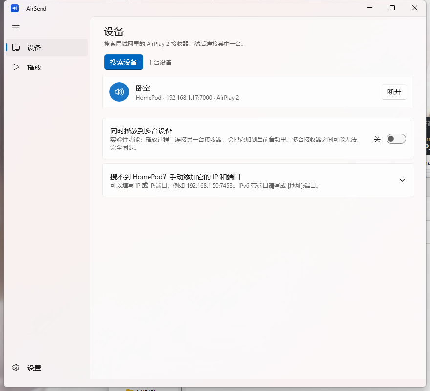
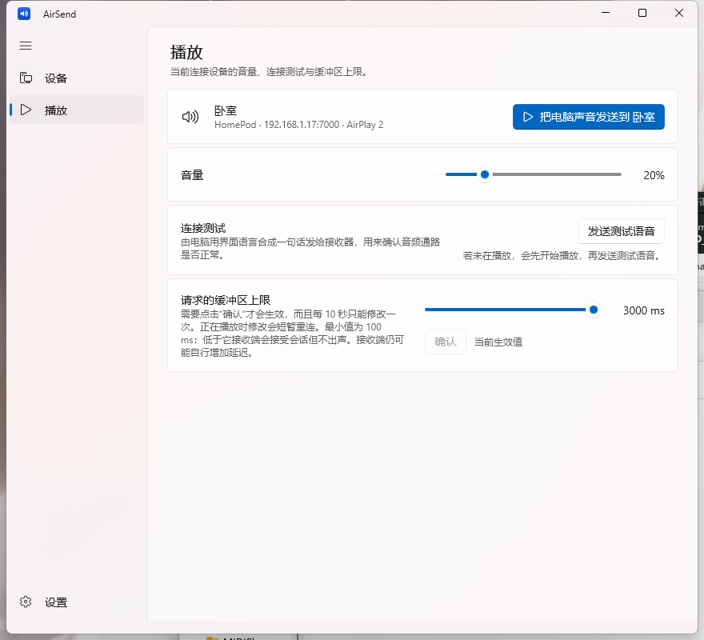
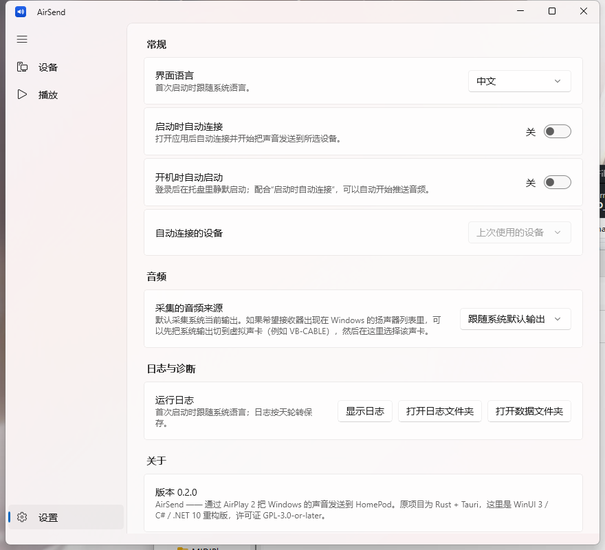

# AirSend

**把 Windows 的系统声音通过 AirPlay 2 低延迟发送到 HomePod。**
WinUI 3 / C# / .NET 10 重构版，源自 [Pabldi08/AirSend](https://github.com/Pabldi08/AirSend)（Rust + Tauri）。

*Send your Windows system audio to a HomePod over AirPlay 2 — a WinUI 3 / C# / .NET 10 rewrite.*

<!-- 下面的徽章假设仓库是 github.com/DusklitSakura/AirSend；改成你自己的路径即可 -->
[](https://github.com/DusklitSakura/AirSend/actions/workflows/build.yml)
[](LICENSE)


---

## 特性

> **哪些是移植的、哪些是本仓库新写的**
> 功能范围、界面流程与**协议行为**（RTSP/SETUP 顺序、瞬态配对、RTP 与 ChaCha20-Poly1305
> 报文布局、ALAC 帧与 magic cookie、SYNC/NTP 授时、延迟与音量策略）都来自原项目
> [Pabldi08/AirSend](https://github.com/Pabldi08/AirSend) 及其协议栈
> [airplay2-rs](https://github.com/Pabldi08/airplay2-rs)（均为 GPL-3.0-or-later），**不是本项目设计的**。
> 本仓库新写的部分只有 **C#/.NET 的实现代码本身**，以及若干平台替换：用自写的 DNS 报文解析
> 取代上游的 `mdns-sd` crate、用自写的 WASAPI COM 互操作取代上游的 `wasapi` crate、
> 用 WinUI 3 取代上游的 Tauri/WebView 界面。详细对照见 [PORTING.md](PORTING.md)，来源声明见 [CREDITS.md](CREDITS.md)。

- **设备发现**〔移植〕：DNS-SD/mDNS 浏览 `_airplay._tcp` / `_raop._tcp`，自动合并同一台设备的两条记录；支持手动添加 IP:端口（路由器不转发 mDNS 时可用）
  —— 上游用 `mdns-sd` crate，本仓库改为手写 DNS 报文解析（不依赖第三方 mDNS 库）
- **音频链路**〔移植〕：WASAPI loopback 采集系统声音 → ALAC 编码 → ChaCha20-Poly1305 加密的 RTP → HomePod，带 NTP 授时与 SYNC 包
- **配对**〔移植〕：瞬态 pair-setup（SRP-6a，3072 位群 / SHA-512）+ pair-verify（Curve25519 + Ed25519），RTSP 全程加密
- **音量以接收端为准**〔本移植新增〕：连接时读取接收端**实际**音量，不覆盖你在 HomePod 上调好的值（上游只写不读）
- **听力保护**〔本移植新增〕：音量越过 35% 弹确认（可勾选「本次启动不再提醒」）；降到 5% 以下给 5 秒悬浮提示
- **连接测试语音**〔本移植新增〕：由电脑用 Windows 语音合成念一句**当前界面语言**的话发给接收器，用来确认音频通路（上游只有命令行提示音；无对应语音时回退 440Hz）
- **桌面集成**：托盘 + 关闭到托盘〔移植〕；单实例〔新增〕、开机自启动〔新增〕（配合「启动时自动连接」可实现登录即静默推流）
- **界面**：竖向导航 + WinUI 官方 SettingsCard〔重写，上游是单页 WebView〕；西班牙语/英语〔移植〕、中文〔新增〕，首次启动跟随系统语言
- **分发**：免 MSIX、免安装、免开发者模式，解压即用的 zip〔本移植改动，上游是 NSIS 安装包〕

## 截图

| 设备 | 播放 | 设置 |
|---|---|---|
|  |  |  |

## 下载

从 [Releases](../../releases/latest) 下载对应架构的 zip，解压后直接运行 `AirSend.exe`（无需安装器，无需开发者模式）。

| 包 | 需要预先安装 | 体积参考 |
|---|---|---|
| `AirSend-<版本>-win-<架构>-selfcontained.zip` | **什么都不用装**（.NET 运行时与 Windows App SDK 都打包在内） | x64 ≈ 92 MB · x86 ≈ 65 MB · arm64 ≈ 89 MB |
| `AirSend-<版本>-win-<架构>-frameworkdependent.zip` | .NET 10 Desktop Runtime **和** Windows App SDK 2.5 Runtime | x64 ≈ 28 MB · x86 ≈ 12 MB · arm64 ≈ 28 MB |

架构怎么选：普通 PC 选 **x64**；骁龙/ARM PC 选 **arm64**；32 位 Windows 选 **x86**。
拿不准就用 `selfcontained` + `win-x64`。

## 使用

1. 打开应用 → **设备**页点「搜索设备」，列表里会出现局域网中的 AirPlay 2 接收器
2. 点设备的「连接」→ 弹窗询问是否立即推送 → 选「开始发送」即开始把电脑声音发过去（选「稍后」只保持连接）
3. **播放**页：播放/停止、音量、连接测试语音、AirPlay 缓冲区上限
4. **设置**页：界面语言、启动时自动连接（可指定设备）、开机自启动、采集来源、日志与诊断、关于

需要注意的几点：

- 缓冲区上限**最小 100 ms**：再低接收端会接受会话但不出声；默认 3000 ms 更稳
- 音量以接收端为准；若要临时确认通路，用「连接测试语音」
- 想固定采集某个播放设备（例如耳机），在**设置 → 音频 → 采集的音频来源**里选它

## 从源码构建

环境：**Windows 10 1809+** 与 **.NET SDK 10.0.100+**（可选 Visual Studio 2022 / VS Code）。
不需要安装 Windows App SDK 运行时，也不需要开启开发者模式。

```powershell
dotnet build AirSend.slnx -c Release                                  # 编译
dotnet test tests/AirSend.Core.Tests/AirSend.Core.Tests.csproj         # 59 项单元测试
dotnet run --project src/AirSend.App/AirSend.App.csproj                # 直接运行
.\build-release.ps1                                                    # 生成 zip 分发包
.\build-release.ps1 -RuntimeIdentifier win-arm64 -FrameworkDependent   # 指定架构 / 不带运行时
```

### 自动构建

[`.github/workflows/build.yml`](.github/workflows/build.yml) 会在 push / PR 时跑测试，
然后用矩阵编译出 **6 个 zip**（`selfcontained` 与 `frameworkdependent` × `x86 / x64 / arm64`）
作为 Actions 工件；打 `v*` 标签时会自动创建 Release 并附上这 6 个包。

## 常见问题

**搜不到 HomePod**
先确认接收器与电脑在同一网段（尤其 2.4G/5G 分离的路由器），然后点「重新搜索」。
若路由器不转发 mDNS，用**设备 → 手动添加设备**填写 `IP[:端口]`。
安全软件（如 Kaspersky）也会占用 mDNS 的 5353 端口——本应用改用临时端口发问询，已规避这个问题。

**连接上了但没声音**
把缓冲区上限调到 ≥100 ms；确认 HomePod 音量不是 0；用「连接测试语音」确认通路。
若仍无声，看**设置 → 日志与诊断 → 显示日志**里的 RTSP/SETUP 记录。

**怎样让 AirSend 直接出现在 Windows 的扬声器列表里**
Windows 的播放设备列表只接受**内核音频驱动**创建的端点，应用无法把自己加进去
（USB/IP 也不行：`usbipd-win` 只共享物理设备，`usbip-win2` 是需要对端设备实现的客户端）。
现实做法是装一个已签名的虚拟声卡（VB-CABLE / Scream / Voicemeeter），
在**设置 → 音频 → 采集的音频来源**里选中它，再把系统输出切到它。

**日志与数据在哪里**
默认 `%APPDATA%\AirSend\`（`settings.json` + 按天轮转的 `logs\app.YYYY-MM-DD.log`）。
目录不可写时会退回 exe 同目录的 `logs\`。设置环境变量 `AIRSEND_DATA_DIR` 可整体重定向。

## 项目结构

```
src/AirSend.App          WinUI 3 界面：三个视图（设备/播放/设置）、ViewModel、设置、托盘、单实例、语音测试
src/AirSend.Core         协议与音频核心：mDNS 发现、RTSP/二进制 plist、SRP-6a、X25519/Ed25519、
                         ALAC 编码、ChaCha20-Poly1305、RTP、NTP 授时、WASAPI loopback
tests/AirSend.Core.Tests 59 项测试
docs/screenshots         界面截图
PORTING.md               与上游 Rust 版本的逐模块对照、验证记录、已知限制
build-release.ps1        zip 打包脚本
```

## 验证情况

**59 项自动化测试**（`dotnet test`）覆盖：X25519（RFC 7748）、Ed25519（RFC 8032）、
SRP-6a（与独立 Python 实现逐字节比对）、HKDF-SHA512、TLV8、ChaCha20-Poly1305 通道、
二进制 plist（用 Python `plistlib` 交叉验证互通性）、RTSP 客户端（含加密响应）、
mDNS 报文解析（PTR/SRV/TXT/A）、设备归并、延迟映射、ALAC 帧往返（编码器 vs 按 ffmpeg
`libavcodec/alac.c` 的解码流程用 C# 重写、仅用于测试的解码器），以及对着脚本化接收器
跑通的完整握手。

**真机验证**（HomePod gen 2）：设备发现、瞬态配对、加密 RTSP、SETUP/RECORD、
音量读回、SYNC 授时、可听见的音频输出、连接测试语音——细节与排查记录见 [PORTING.md](PORTING.md)。

## 许可证与致谢

本项目是 **[Pabldi08/AirSend](https://github.com/Pabldi08/AirSend)** 的 WinUI 3 / C# 移植，
协议行为以原项目使用的 [airplay2-rs](https://github.com/Pabldi08/airplay2-rs) 为准复刻。
原项目与原协议栈均为 **GPL-3.0-or-later**，因此本移植同样以
[GNU GPL-3.0-or-later](LICENSE) 发布（`LICENSE` 即原项目的许可证原文）。

来源声明见 [CREDITS.md](CREDITS.md)。

---

## English summary

A WinUI 3 / C# / .NET 10 rewrite of AirSend: it captures Windows system audio with
WASAPI loopback and streams it to a HomePod over AirPlay 2 (ALAC + encrypted RTP),
with mDNS discovery, transient SRP pairing, NTP timing, sync packets, receiver volume
read-back, a spoken connection test in the UI language, tray/close-to-tray,
single instance and start-with-Windows.

- **Requirements**: Windows 10 1809+; .NET SDK 10 for building. No MSIX, no Developer Mode.
- **Install**: grab a zip from [Releases](../../releases/latest) — `selfcontained` needs nothing
  preinstalled, `frameworkdependent` needs the .NET 10 Desktop Runtime and Windows App SDK 2.5 Runtime.
- **Build**: `dotnet build AirSend.slnx -c Release`, tests with `dotnet test`,
  packages with `.\build-release.ps1`. CI produces six zips (with/without runtime × x86/x64/arm64).
- **Verified** on a real HomePod: discovery, pairing, SETUP/RECORD, audible audio,
  volume read-back and the spoken connection test.
- **License**: GPL-3.0-or-later, same as the original project.
